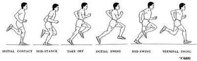
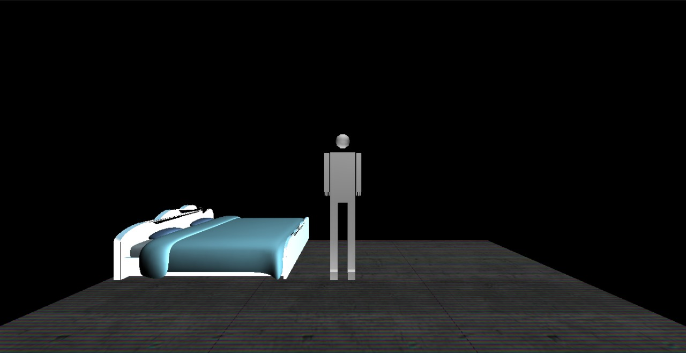
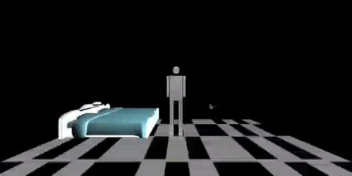
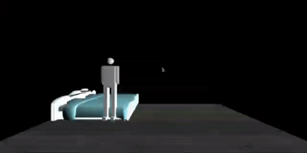
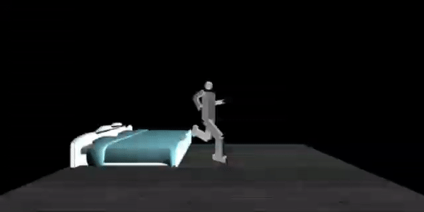

## Part 1

# **Team : 20**


      Name                   SEC    BN     
      
      Ahmed Sayed Ahmed       1     4    
      Esraa Mohamed Saeed     1     10     
      Aya Mahmoud Salama      1     22     
      Sohila Mohamed Maher    1     39     
      Mariam Ashraf Mohamed   2     23  
# Animation,Object loading &texture mapping.

## Steps of implementation:
## a) Animation
1. Making the robot run by using 'z' keyboard button 
1. We made a set of poses by estmating angles from this image and calling them by timer function 

 

```
int poses_run[5][10]={{60,0,60,0,-90,-100,-45,10,45,100},
{60,10,30,35,-80,-90,-30,0,30,130},
{60,10,0,20,-90,-90,-30,-45,45,130},
{60,20,-10,80,-90,-90,30,-70,10,90},
{60,10,50,0,-30,-90,-60,0,100,20},
};

static int f=0;
 void timer_run(int value){
     f=f%5;
     setposes_run(f);
     f++;
     if(f<=25){
     glutPostRedisplay();
     glutTimerFunc(800,timer_run,0);}
 }

 void setposes_run(int frameNum)
 {  body=poses_run[frameNum][0];
   xbody=poses_run[frameNum][1];
     rxshoulder=poses_run[frameNum][2];
     lxshoulder=poses_run[frameNum][3];
     rxelbow=poses_run[frameNum][4];
     lxelbow=poses_run[frameNum][5];
     rfrontfemur=poses_run[frameNum][6];
     lfrontfemur=poses_run[frameNum][7];
     rtibia=poses_run[frameNum][8];
     ltibia=poses_run[frameNum][9];
     
 }
    case 'z':
     glutTimerFunc(0,timer_run,0);
     break;
 ```
## b) Object loading
1. loaded a bed using the drawmodel function  

```
void drawmodel(char *filename)
{
	GLMmodel *model = glmReadOBJ(filename);
	glmUnitize(model);
	glmFacetNormals(model);
	glmVertexNormals(model, 90.0);
	glmScale(model, .15);
	glmDraw(model, GLM_SMOOTH | GLM_MATERIAL);
}
```
2. displayed the object after scaling ,translating and rotation 
 ```
    glPushMatrix();
    glTranslatef(-6.0, -3.0, -9);
    glRotatef(90, 0.0, 1.0, 0.0);
	glScalef(50, 50,50);
	drawmodel((char *)"data/lettoCloud.obj");
	glPopMatrix();
```
3. Made the robot interact with the loaded object :
   a)used keyboard buttons("c","n")to move the robot forward ,backword ,right & lift then it can set on the bed by using "m" button .

```
 case 'c':
     stepx=stepx+2;
     break;
     case 'C':
     stepx=stepx-2;
     break;
     case 'n':
     stepz=stepz-2;
     break;
     case 'N':
     stepz=stepz+2;
     break;
     
```
b) For set down We made another set of poses with its timer function
```
double poses_setting[4][6]={{-0.2,-30,-30,30,30,0},
{-0.4,-45,-45,45,45,0},
{-0.7,-60,-60,60,60,0},
{-1.5,-90,-90,90,90,-1},
};

void setposes_setting(int frameNum)
 {    stepy=poses_setting[frameNum][0];
     rfrontfemur=poses_setting[frameNum][1];
     lfrontfemur=poses_setting[frameNum][2];
     rtibia=poses_setting[frameNum][3];
     ltibia=poses_setting[frameNum][4];
     stepz=poses_setting[frameNum][0];
 }

static int d=0;
 void timer_setting(int value){
     d=d%5;
     setposes_setting(d);
     d++;
     glutPostRedisplay();
 }
```
## b) Texture mapping

1. For texture we used the following function for creating floor and adding texture to it and render it
 ```
 void displayEnvironment(void)
{
    glClear(GL_COLOR_BUFFER_BIT | GL_DEPTH_BUFFER_BIT);

    glMatrixMode(GL_MODELVIEW);
    glLoadIdentity();

    gluLookAt(eye[0], eye[1], eye[2], center[0], center[1], center[2], up[0], up[1], up[2]);
    glPushMatrix();
    glScalef(5.1, 5.1, 10.1);
    glEnable(GL_TEXTURE_2D);
    glBindTexture(GL_TEXTURE_2D, _textureId);

    glTexParameteri(GL_TEXTURE_2D, GL_TEXTURE_MIN_FILTER, GL_LINEAR);
    glTexParameteri(GL_TEXTURE_2D, GL_TEXTURE_MAG_FILTER, GL_LINEAR);

    glBegin(GL_QUADS);
	glNormal3f(0.0, 1.0, 0.0);
	glTexCoord2f(0.0f, 0.0f); glVertex3f(-10, -10, 10);
	glTexCoord2f(3.0f, 0.0f); glVertex3f( 10, -10,  10);
	glTexCoord2f(3.0f, 3.0f); glVertex3f( 10, -10, -10);
	glTexCoord2f(0.0f, 3.0f); glVertex3f(-10, -10, -10);
	glEnd();
	glDisable(GL_TEXTURE_2D);
	glPopMatrix();
	glutSwapBuffers();
    display();
    }

     void initRendering(const char* floorname, GLuint textureId){
        glClearColor(0.0, 5.0, 5.0, 0.0);
        glShadeModel(GL_FLAT);

        Image* image = loadBMP(floorname);
        _textureId = loadTexture(image);
        delete image;
 ```
 2. we then made a menu by clicking right click to choose the desired floor and attached it to the scene
 ```
 void screen_menu(int value)
{

	switch (value)
	{
	case '1':
		modelname = "data/floor.bmp";
		break;
	case '2':
		modelname = "data/grass-background.bmp";
		break;
	case '3':
		modelname = "data/wood.bmp";
		break;
	
	}
    glutPostRedisplay();
}
void attachMenu()
{
    glutCreateMenu(screen_menu);
    glutAddMenuEntry("floor1", '1');
    glutAddMenuEntry("floor2", '2');
    glutAddMenuEntry("floor3", '3');
    glutAttachMenu(GLUT_RIGHT_BUTTON);
}
```
### *  All of this was added to the previous robot display ,rotations and camera plus adding light source to the scene 
```

GLfloat light_ambient[] = {0.0, 0.0, 0.0, 0.0};
GLfloat light_diffuse[] = {0.5, 0.5, 0.5, 1.0};
GLfloat light_specular[] = {1.0, 1.0, 1.0, 1.0};
// x , y, z, w
GLfloat light_position[] = {0.5, 5.0, 0.0, 1.0};
GLfloat lightPos1[] = {-0.5, -5.0, -2.0, 1.0};

void initRendering(const char* floorname, GLuint textureId){
   // Lighting and Rendering Stuff
   glClearColor(0.0, 5.0, 5.0, 0.0);
    glShadeModel(GL_FLAT);
    
	Image* image = loadBMP(floorname);
	_textureId = loadTexture(image);
	delete image;
   // Turn on the power
   glEnable(GL_LIGHTING);
	// Flip light switch
	glEnable(GL_LIGHT0);
	glEnable(GL_LIGHT1);
	// assign light parameters
	glLightfv(GL_LIGHT0, GL_AMBIENT, light_ambient);
	glLightfv(GL_LIGHT0, GL_DIFFUSE, light_diffuse);
	glLightfv(GL_LIGHT0, GL_SPECULAR, light_specular);
	glLightfv(GL_LIGHT1, GL_AMBIENT, light_ambient);
	glLightfv(GL_LIGHT1, GL_DIFFUSE, light_diffuse);
	glLightfv(GL_LIGHT1, GL_SPECULAR, light_specular);
	// Material Properties
	GLfloat lightColor1[] = {1.0f, 1.0f, 1.0f, 1.0f};
	glLightfv(GL_LIGHT1, GL_DIFFUSE, lightColor1);
	glLightfv(GL_LIGHT1, GL_POSITION, lightPos1);
	glLightfv(GL_LIGHT0, GL_DIFFUSE, lightColor1);
	glEnable(GL_NORMALIZE);
	//Enable smooth shading
	glShadeModel(GL_SMOOTH);
	// Enable Depth buffer
	glEnable(GL_DEPTH_TEST);
}
```
### * applied depth buffer because more than one object is now in scene and applied material properties 
 ```
    GLfloat mat_amb_diff[] = { 0.0, 0.0, 1.0, 1.0 };
    GLfloat mat_specular[] = { 0.0, 0.0, 0.0, 1.0 };
    GLfloat shininess[] = { 30.0 };

    glMaterialfv(GL_FRONT_AND_BACK, GL_AMBIENT_AND_DIFFUSE, mat_amb_diff);
    glMaterialfv(GL_FRONT, GL_SPECULAR, mat_specular);
    glMaterialfv(GL_FRONT, GL_SHININESS, shininess);

```
## Screenshots and GIFs Results .



